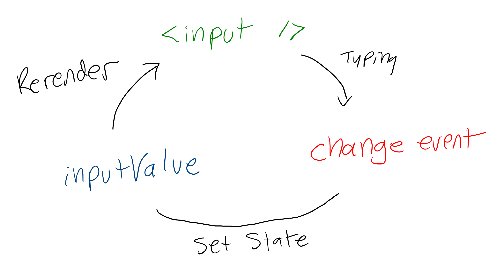

# React: Controlled Forms

React is all about one-way data flow. However, form inputs are naturally two-way; you want to be able to set the value of an input programmatically, and you want the value to change when a user types. Luckily, this can be accomplished by a circular approach to managing state called controlled forms.

If you're trying to control the state of an input, you could use an approach like this:

```js
const FormInput = () => {
  const [inputValue, setInputValue] = useState("")
  const updateValue = event => setInputValue(event.target.value)

  return (
    <fieldset className="FormInput">
      <label htmlFor="form-input">Username</label>
      <input id="form-input" type="text" value={inputValue} onChange={updateValue} />
    </fieldset>
  )
}
```

[Play with this code](https://codesandbox.io/s/shy-smoke-62fuh)

1. The `useState` hook sets a variable called `inputValue` to `""`, and gets a function called `setInputValue` that will update the value.
2. A function called `updateValue` is created that accepts an `event` as a parameter and calls `setInputValue` with `event.target.value`, which will be the whatever the current value of the input is.
3. A JSX element is returned that has its value set to `inputValue`, and whenever a user changes the value of the input, the `updateValue` function will be called.

Put differently, the value of the `<input />` is `inputValue`, and when it changes `updateValue` is called, which changes the value of `inputValue`. This is the circular flow of controlled forms.



This works for a single input, but to truly capture user input, it needs to be done in the context of an entire form. That looks like this:

```js
import { useState } from "react"

export default const LoginForm = ({login}) => {
  const [username, setUsername] = useState("")
  const [password, setPassword] = useState("")

  const updateUsername = event => setUsername(event.target.value)
  const updatePassword = event => setPassword(event.target.value)
  const handleSubmit = event => {
    event.preventDefault()
    login(username, password)
  }

  return (
    <form onSubmit={handleSubmit}>
      <label for="username">Username</label>
      <input type="text" id="username" value={username} onChange={updateUsername} />

      <label for="password">Username</label>
      <input type="password" id="password" value={password} onChange={updatePassword} />

      <input type="submit" value="Login" />
    </form>
  )
}
```

[Play with this code](https://github.com/sikaeducation/react-controlled-form)

This looks more complicated, but it functions similarly:

1. A function called `login` is passed as a prop that accepts a `username` and `password` as parameters. This will handle the actuall HTTP request once the form is filled out.
2. Stateful variables called `username` and `password` are initialized, as are functions to update them
3. Event handlers for updating both text inputs are defined
4. An event handler for the form submission is defined that calls the `login` function with the values of `username` and `password` at the time the event handler is called
5. The form calls `handleSubmit` when the form is submitted
6. The input change handlers are called whenenver a user types in the inputs

A stateful variable is bound the value of the input, the input's change event updates the stateful variable, the value of the input is updated.
