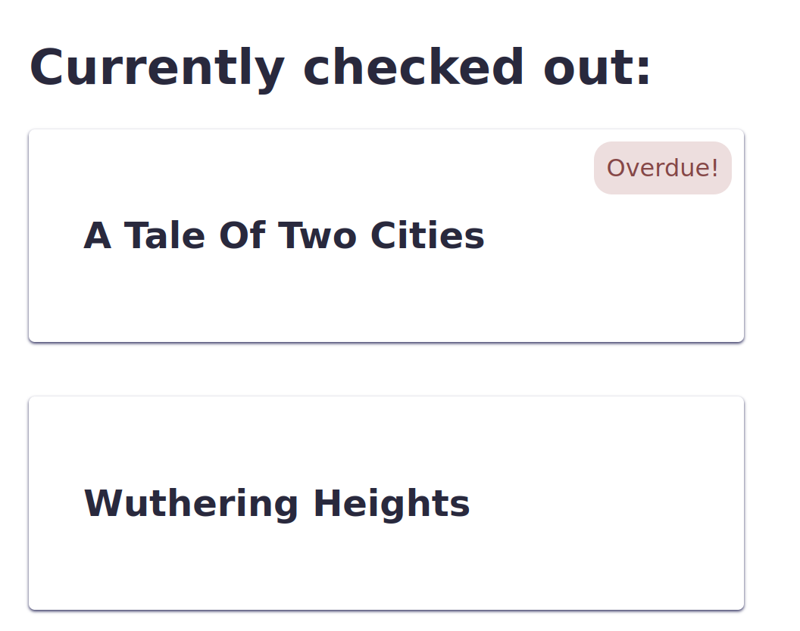

# React: Conditional Rendering

Many components need to render some parts of the template in certain cases but not others. For example, a library book app may have an `Overdue` badge that only shows up if today's date is after the book's due date. How would you conditionally render this content with JSX?

```jsx
const BookListing = ({ title, dueDate }) => {
  const isOverdue = Date.parse(dueDate) < Date.now()

  return (
    <div className="BookListing">
      <h2>{title}</h2>
      {
        isOverdue && <span className="alert badge">Overdue!</span>
      }
    </div>
  )
}
```

[Play with this code](https://codesandbox.io/s/little-surf-b2qot?file=/src/BookListing.js)



This component:

1. Calculates a boolean value for whether or not the book is overdue and stores it in `isOverdue`
2. The template checks whether `isOverdue` is truthy or falsy
  * If it's true, it renders the JSX element `<span className="alert badge">Overdue!</span>`
  * If it's false, it renders nothing

You can also use a variation on this technique with ternaries to render different content in each case:

```jsx
const BookListingWithDaysRemaining = ({ title, daysRemaining }) => {
  const isOverdue = daysRemaining <= 0

  return (
    <div className="BookListing">
      <h2>{title}</h2>
      {
        isOverdue
          ? <span className="alert badge">Overdue!</span>
          : <span className="badge">{daysRemaining} days remaining</span>
      }
    </div>
  )
}
```

[Play with this code](https://codesandbox.io/s/little-surf-b2qot?file=/src/BookListingWithDaysRemaining.js)


## Watch Out!

The reason that the boolean comparison `&&` works to conditionally render an element is that if the first condition is true, the browser attempts to render the second one. If the first condition is false, the browser ignores the rest of the expression since `&&` can't be satisfied.

---

The reason that JSX uses ternaries instead of `if`/`else` is that JSX allows any JS expression, but no JS statements or control structures. That means no `if`/`else`, `for`, variable assignments, and so on.

---

Since JSX allows you to do any JavaScript expression, you can also write all of the conditional logic in the template directly:

```jsx
return (
  <div className="book-listing">
    <h2>{title}</h2>
    {
      Date.parse(dueDate) < Date.now()
        ? <span className="alert badge">Overdue!</span>
        : null
    }
  </div>
)
```

This is almost always harder to read and understand than testing for simple boolean values.

## Additional Resources

| Resource | Description |
| --- | --- |
| [React: Conditional Rendering](https://reactwithhooks.netlify.app/docs/conditional-rendering.html) | React's guide to conditional rendering |
| [React: Conditional Rendering](https://reactwithhooks.netlify.app/docs/conditional-rendering.html) | React's guide to conditional rendering |
