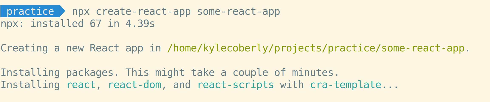
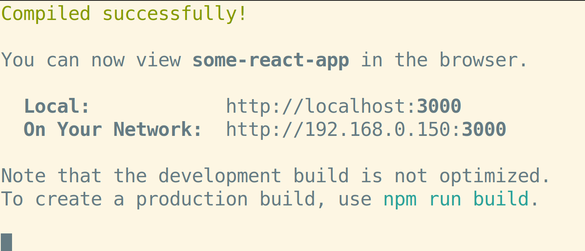
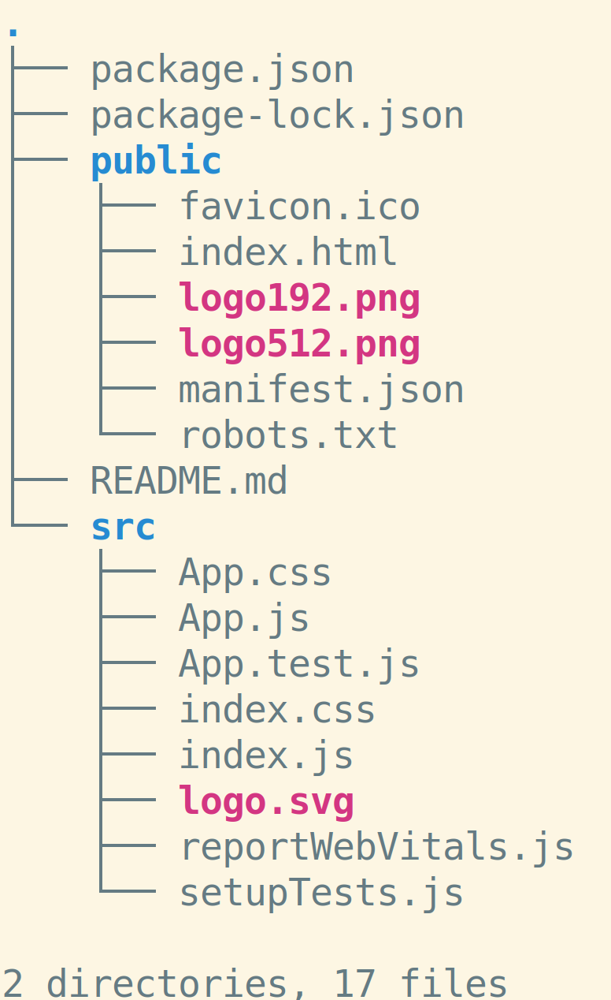

# Create React App

It's difficult to write and run React-based apps directly in the browser. Luckily, there are tools available that do lot of the heavy-lifting for you. One of the simplest of these is called Create React App, or CRA.

## Running CRA

To make a new CRA project, run `npx create-react-app project-name-goes-here`. This creates a new React project with all the necessary parts installed and wired together.

## Serving CRA Apps

To run a local server for an app built with CRA, run `npm start` anywhere in the project directory. By default, CRA will host the app at `http://localhost:3000` and will automatically update the browser every time you save changes to the project. To stop serving an app, press `ctrl` + C.

## Folder Structure

There two folders in a fresh CRA project that you should be aware of.

### `public`

The `public` directory contains static assets, such as images, fonts, and favicons. React doesn't do anything special with these and you can't import them into your projects, but they will be hosted on your server. For example, if you have a file in the `public` directory called `profile.jpg`, it will be available by default at `localhost:3000/profile.jpg`.

### `src`

All of your React components go in this directory. The `App.js` file is considered your top-level component and should be left there, but it can be modified. Everything else in the `src` folder is available for you to add to, delete, modify, or organize however you like.

## Watch Out!

* After creating an app with CRA, don't forget you still need to `cd` into the folder.
* If port 3000 is already being used on your computer (such as by another instance of CRA), you will be asked if you would like to serve the app on another port instead.

## Additional Resources

| Resource | Description |
| --- | --- |
| [Create React App](https://create-react-app.dev/docs/getting-started) | Official guide to Create React App |

## Additional Resources

| Resource | Description |
| --- | --- |
| [React With Hooks](https://reactwithhooks.netlify.app/) | Comprehensive guide to React |
| [Thinking in React](https://reactwithhooks.netlify.app/docs/thinking-in-react.html) | Overview of React philosophy |
| [Video: Render Components](https://www.youtube.com/watch?v=9U3IhLAnSxM&t=2217s) | React Hooks Crash Course: Traditional Rendering |
| [Video: Create React App](https://www.youtube.com/watch?v=9U3IhLAnSxM&t=2417s) | React Hooks Crash Course: CRA |
