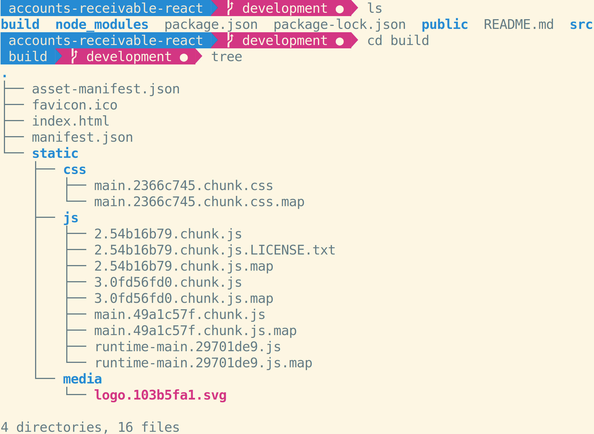

# React: Deployment

Deploying SPAs is a little different that deploying static websites. Your browser only understands HTML, CSS, and JavaScript; it can't process JSX, Node packages, and many other things used to build React apps. How do you translate between React apps and JSX and HTML, CSS, and JavaScript?

## Building

To build a React app that was created with `create-react-app`, use `npm run build`. This will take all of your React components, stylesheets, images, and other assets and transpile them to a format browsers can use. All of these files will be located in the `build` directory:

## Deploying

Once built, the `build` folder is like any other website and can be deployed with `npx surge` or any other static hosting provider.

## Watch Out!

Changes made to your app aren't automatically built or deployed. Every time you to redeploy, you must build and deploy again.

## Additional Resources

| Resource | Description |
| --- | --- |
| [CRA: Deployment](https://cra.link/deployment) | Official CRA docs on deployment |
