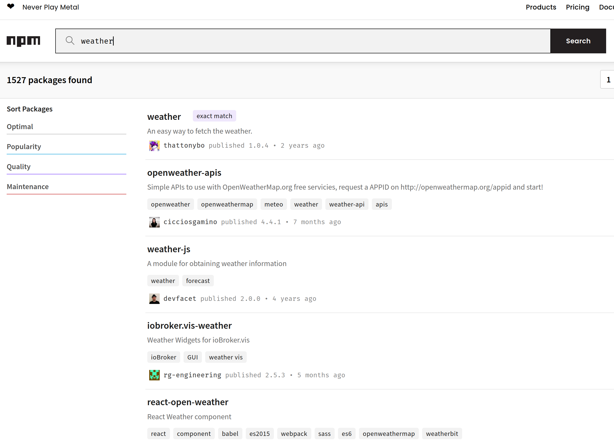
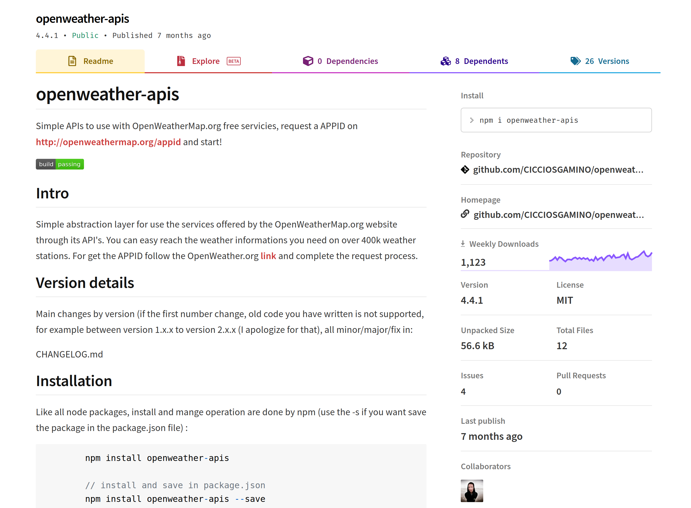
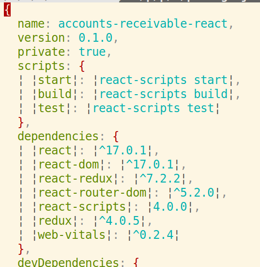

# npm

npm, or Node Package Manager, is a tool for installing and using code that others have written and shared.

## Searching for Packages

When you have a problem you suspect already has a published solution, you can look for a package on [npmjs.com](https://www.npmjs.com/). For example, if you're looking for ways to work with weather data, you might search for "weather":



You can view details about any package here, including instructions on how to use it, source code, how recently it's been updated, and more.



In general, packages with more weekly downloads can be expected to be more robust and reliable than packages with fewer weekly downloads. Consider this when selecting packages.

## Installing Packages

Add npm packages to projects with `npm install package-name-here`. For example, to install the popular library Lodash:

```bash
npm install lodash
```

Installing a package adds information about the install to the `package.json` and `package-lock.json` files that other users can use to redownload the packages when they run your code.

## Using Packages

Once a package has been installed, it can be used by importing it:

```js
import _ from "lodash"

const someArray = [1, 2, 3]
const someOtherArray = [2, 4, 6]

console.log(_.intersection(someArray, someOtherArray)) // [2]
```

If a package has specific parts available as named exports, you can import them too:

```js
import { intersection } from "lodash"

const someArray = [1, 2, 3]
const someOtherArray = [2, 4, 6]

console.log(intersection(someArray, someOtherArray)) // [2]
```

Note that this syntax is similar to the syntax for JavaScript object destructuring, but works very differently. You can't destructure an object while importing a package.

## Using npm Scripts

`package.json` files have a `scripts` key that defines different scripts that can be run from the command line. For example, React apps built with CRA come with these by default:



This app has 4 scripts: `start`, `build`, `test`, and `eject`. `start` and `build` are special keywords in npm that can be run as follows:

```bash
npm test
npm start
```

For all other scripts, such as `build` and `eject`, add the keyword `run`:

```bash
npm run build
npm run eject
```

This is useful for adding utility scripts to your projects that others can use.

## Installing Dependencies

When you clone a new repo that uses npm packages or pull Git commits that add new dependencies, the first thing you need to do is install the dependencies. To do this in a Node.js project, run `npm install` without any other arguments.

## Watch Out!

In every project with npm packages, you should have a file called `.gitignore` in the root of the project directory with at least the following contents:

```
node_modules
```

This prevents Git from adding all of your installed npm packages to your repository. A `node_modules` folder can be extremely large; even larger than sites like GitHub will allow you to store. The `package.json` and `package-lock.json` files contain all the necessary instructions for other users to download the dependencies themselves, so version controlling these 2 small files is sufficient for tracking all the dependencies your project uses.

---

Importing an npm package  is similar to importing a JavaScript module you've written, such as a component. The difference is that npm packages are imported by their name, and a regular module import must start with `.` or `..`. For example:

```react
import lodash from "lodash" // npm package
import SomeComponent from "./SomeComponent" // Same folder
import SomeOtherComponent from "../some-folder/SomeOtherComponent" // Adjacent folder
```

---

**Never** `sudo npm install` any package. Npm packages can be made and published by anyone, and not all of those people have your best interests in mind. `sudo npm install`ing a package can give the package maintainer administrative control of your computer.

---

`package.json` is JSON, not JavaScript. All keys and string values must be double-quoted, no trailing commas are allowed.

## Additional Resources

| Resource | Description |
| --- | --- |
| [npm](https://www.npmjs.com/) | npm's officially site |
| [Toptal: A guide to npm](https://www.toptal.com/javascript/a-guide-to-npm-the-node-package-manager) | Overview of npm's features |
