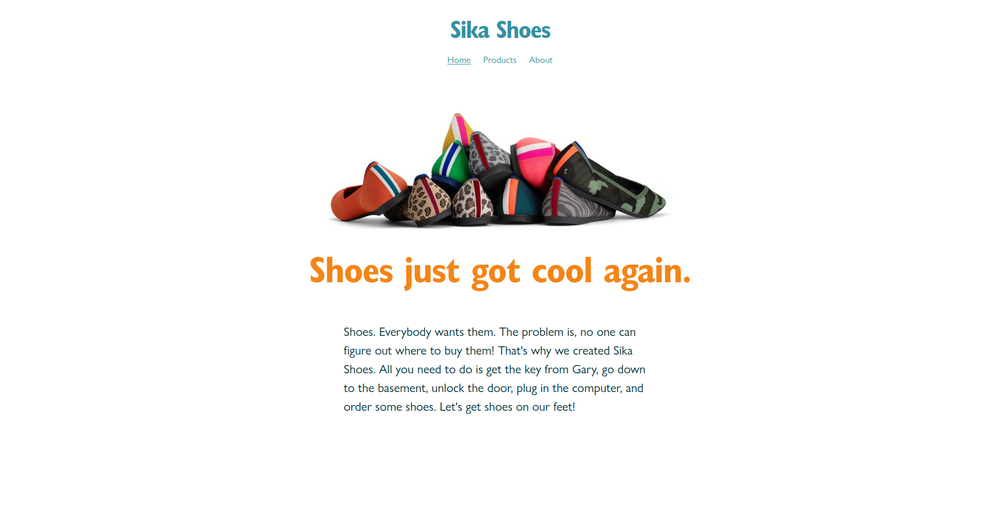

# Sika Shoes: Routing

Refactor the included React app to use routing.

* The URL should update on navigation.
* The product routes should dynamically render the selected product.
* Navigating directly to a nested URL should render the appropriate view.
* The active page should be highlighted in the navigation bar

## Rubric

* [ ] - URL updates on navigation, including individual products
* [ ] - No hard-coded data
* [ ] - Loading a nested URL directly renders the page
* [ ] - The current view is underlined in the navigation bar
