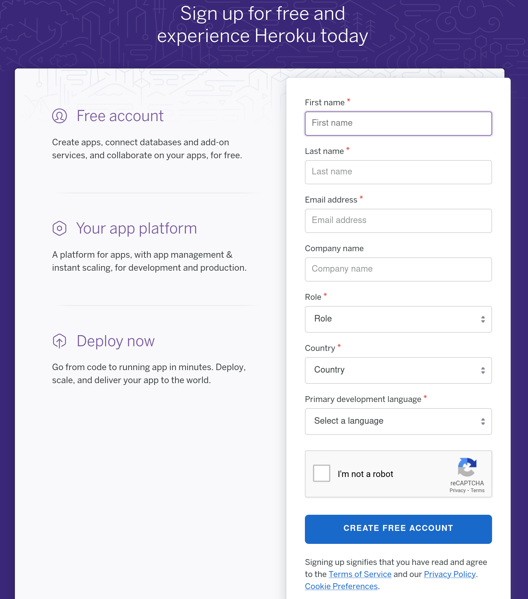
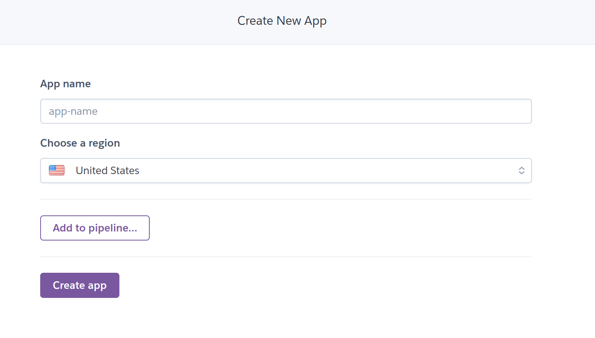
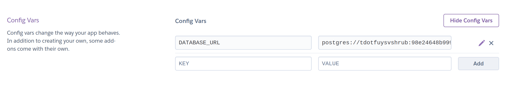

# Cloud Deployment: Heroku

How do you deploy an API to Heroku?

## Creating an Account

Go to [heroku.com](https://heroku.com) and create an account. You are required to give them a credit card number to create an account, but you can do everything needed to host APIs for small projects for free.

Next, follow the instructions on the [Heroku CLI help page](https://devcenter.heroku.com/articles/heroku-cli#download-and-install) for installing the Heroku Toolbelt for your operating system. After you've installed the Heroku Toolbelt, run `heroku login`. You'll be directed to login to Heroku from your default browser, after which your terminal will stay logged into Heroku indefinitely. This is useful for creating apps on the CLI, viewing an app's logs locally, manually deploying, and more.

## Creating an App

While logged in, click "New" on the Heroku dashboard. You'll be prompted to enter a name, which needs to be unique within all of Heroku and will show up in the URL. Then, click "Create App".

## Setting Up Deployment

The easiest way to deploy code with Heroku is to connect it to a repository on Github. Go to "Deploy" -> "Deployment Method" -> "GitHub". Search for your repository on GitHub to connect it. Choose the Git branch you'd like to deploy (usually `main` or `master`). You can manually press the "Deploy Branch" button every you want to deploy, or you can press "Enable Automatic Deploys" to automatically redeploy your app everytime you push new code to GitHub.

## Config Vars

Often, you'll have parts of your app that are different when running locally vs. on Heroku. For example, you may want to use a local database in development, and one of Heroku's databases in production. These are called "environment variables." In the "Settings" tab for a Heroku app, press the button that says "Reveal Config Vars."

The form you see allows you to set keys and values for environment variables your app can use. In a Node app, these are available to you in the `process.env` object. For example, if you set `DATABASE_URL` to `postgres:///some-data-basename` in Heroku's config vars, then logging `process.env.DATABASE_URL` will result in `postgres:///some-database-name` being printed to the console.

## Logging

To view traffic and console logs for a Heroku app in real-time, do one of the following:

* Go to "More" (upper right corner of the dashboard) -> "View Logs"
* Run `heroku logs -a app-name-goes-here --tail` in the terminal. You can press "Control" + "C" to stop.

This is helpful for debugging an app that works locally but isn't working on Heroku.

## Watch Out!

By default, a Heroku app will sleep if it hasn't received any requests for 30 minutes. This means the next request it gets will need to wake up the server, which causes a substantial delay in the response. This is a limitation of Heroku's free tier. To keep an app awake full-time, go to "Resources" -> "Change Dyno Type" -> "Hobby". This costs $7 a month to run, but is prorated down to the second.

## Additional Resources

| Resource | Description |
| --- | --- |
| [Heroku: Deploying With Git](https://devcenter.heroku.com/articles/git) | Heroku's official guide to deploying with Git |
