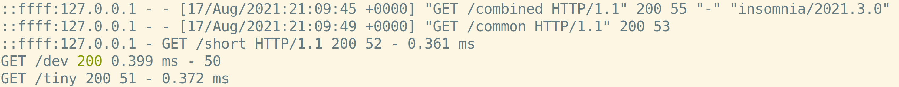

# Express: Logging

When an Express app gets an HTTP request, the request itself is a valuable troubleshooting tool. Luckily, there's Express middleware that prints out information about every request to the console.

## Installing Morgan

To add the Morgan logging middleware to an Express app, use `npm install`:

```bash
npm install morgan
```

## Configuring Morgan

To configure Morgan for an express app, import it and pass it to `app.use()`:

```js
const express = require("express")
const app = express()

const morgan = require("morgan")
app.use(morgan("dev"))
```

`app.use()` matches every request, and the string passed to `morgan()` determines how the logs are formatted. These are the 5 predefined logging formats, from most to least verbose:

* `"combined"`
* `"common"`
* `"short"`
* `"dev"`
* `"tiny"`

For debugging purposes, `"dev"` is a good default:



[Play with this code](https://codesandbox.io/s/affectionate-water-4gkgg)

## Additional Resources

| Resource | Description |
| --- | --- |
| [Express: `morgan`](http://expressjs.com/en/resources/middleware/morgan.html) | Express's documentation on Morgan |
