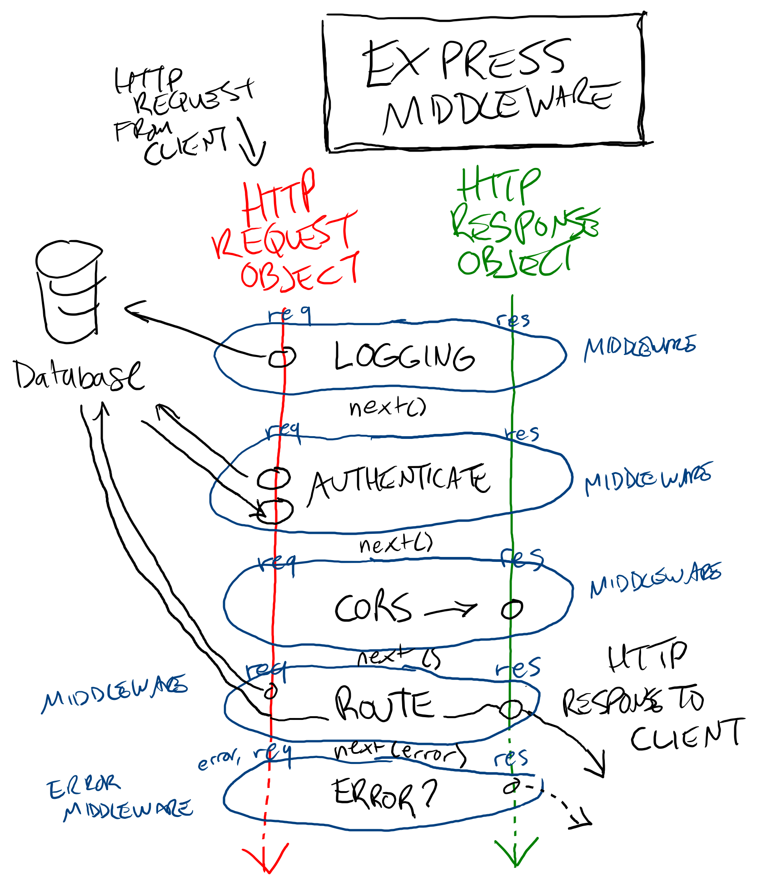

# Express Middleware

Some things API servers need to do when fulfilling HTTP requests are common, such as:

* Adding a particular header to the response
* Authenticating a user based on a token in the request
* Validating that the correct data was sent in the request

Since they're common, it makes sense to extract them into functions:

```js
app.get("/", (request, response) => {
  response = addCORSHeader(response)
  request = lookupUser(request)
  request = validateRequest(request)

  // Rest of route
})
```

This is awkward because it's repetitive to use in every route and adds a lot of bulk and noise. How can it be improved?

## The Middleware Pattern

Express, like other API server software, is primarily based around HTTP requests and responses. A request comes into the server, a response comes out. Consider this example of a route the looks up a requested product:

```js
app.get("/products/:productId", addCORSHeader, lookupUser, validateRequest, (request, response, next) => {
  const product = Product.find(request.params.productId)
  if (!product){
    const error = new Error("Couldn't find product")
    next(error)
  }

  response.json({
    user: request.user,
    product,
  })
})

app.use((error, request, response, next) => {
  response.status(400).json({
    error: `There was error with this request: ${error.message}`,
  })
})

function addCORSHeader(request, response, next){
  response.set("Access-Control-Allow-Origin", "*")
  next()
}

function lookupUser(request, response, next){
  const authToken = request.get("Authorization")
  request.user = User.find(authToken)
  next()
}

function validateRequest(request, response, next){
  if (request.params.productId){
    next()
  } else {
    const error = new Error("product_id is required")
    next(error)
  }
}
```

[Play with this code](https://codesandbox.io/s/gifted-shadow-k0g4z)

1. All `GET` requests to `/products/:productId` start by adding a CORS header to the `response` object
2. Next, a user is looked up and added to the `request` object
3. Next, the request is validated to ensure the product was requested correctly
4. Next, the requested product is looked up and the response is sent back to the user
5. If an error occurs at any step, the error handling middleware sends back a `400` HTTP response and a description of the error

The middleware pattern in Express has a `request` and `response` object that are passed one after the other into middleware functions. Each function takes in the `request` object, the `response` object, and an optional `next` function. When `next` is called with no arguments, it moves to the "next" middleware function until `.json()`, `.sendStatus()` is called. If `next` is called with an argument, Express assumes that something went wrong and it passes control to an error handler middleware function. This allows us to abstract out all of the behavior for a route into individual functions, which greatly improves both readability and reusability.



## Routes As Middleware

If middleware functions look a lot like route handlers, it's because route handlers are just middleware.

```js
function routeHandler(request, response){
  response.sendStatus(200)
}

app.get("/", addCORSHeader, lookupUser, validateRequest, routeHandler)
```

Since route handlers typically send the HTTP response back to the client by calling `response.json()` or `response.sendStatus()`, they're intended to be the last middleware in the chain. As such, they usually only call `next()` for errors.

## Watch Out!

* Middleware functions don't `return` values. Data is shared between them by attaching values to the `request` and `response` objects, and the order of execution is determined by the order they're put in the route definition.
* `next()` doesn't need to be called with `request` and `response`, they'll automatically be available in the next middleware function. You should only call `next` with an argument if an error occurs.

## Additional Resources

| Resource | Description |
| --- | --- |
| [Express: Using Middleware](https://expressjs.com/en/guide/using-middleware.html) | Official guide to Express middleware |
| [Express: Middleware](http://expressjs.com/en/resources/middleware.html) | Full list of popular middleware modules for Express |
