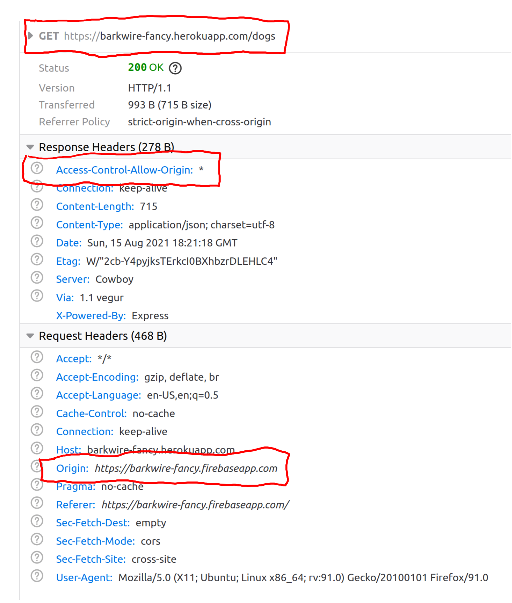
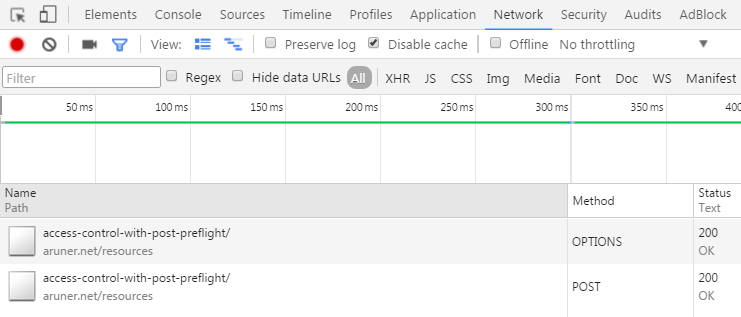
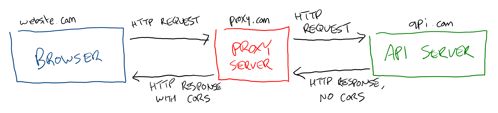
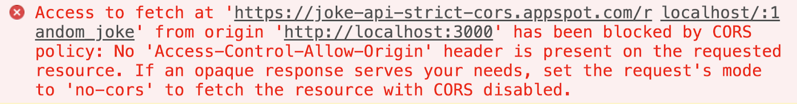

# HTTP: CORS

When a browser makes an HTTP request with something like `fetch`, by default it will only make that request to a URL on the same domain for security reasons. Ordinarily, that would restrict websites from using any third-party API or even APIs on different subdomains.

Meanwhile, APIs often need to restrict which sites can make requests to them. If another server is requesting data from the API the IP address can be blocked or throttled, but this strategy doesn't work with web clients. All an attacker needs to do to send a request from a new IP address is move to a different wifi hotspot. Luckily, there's a strategy that helps address both problems.

## `Access-Control-Allow-Origin`

The `Access-Control-Allow-Origin` HTTP response header specifies one of two things:

* A specific domain, ideally matching the one that issued the request
* `*`, a "wildcard" indicating that any domain can make requests to that URL

To allow an HTTP request from a domain other than the one the API is on, one of those needs to match.

## Preflighting

Before a browser actually makes a HTTP request to another origin, it checks to see if that request will be allowed. This is done with an HTTP request using the `OPTIONS` method, and it expects an `Access-Control-Allow-Origin` header with an appropriate value to be present on the HTTP response. If the browser gets such a response, it executes the original HTTP request. This strategy is called preflighting. Browsers preflight automatically, but to be successful API servers need to respond to `OPTIONS` requests in addition to the actual API requests.

## Proxying

If an API lacks the `Access-Control-Allow-Origin` header and you don't control the API, you'll need to proxy the request:

1. A script on your site, `website.com`, makes an HTTP request to an API you control, `proxy.com`
2. `proxy.com` makes an HTTP request to `api.com`
3. `api.com` sends a response to `proxy.com` because `api.com` is a server, not a browser
4. `proxy.com` adds the `Access-Control-Allow-Origin` header to the response from `api.com` and sends the whole thing back to `website.com`
5. The script on `website.com` receives the response from `proxy.com` with the `access-control-allow-origin` header, which includes the data from `api.com`

## Watch Out!

* If you get an error saying something like `No 'Access-Control-Allow-Origin' header is present on the requested resource.`, it means the response was missing an `Access-Control-Allow-Origin` header that either specified the URL the request came from or the wildcard (`*`). This is also the case with the `OPTIONS` preflight request.

* Do not install browser plug-ins that disables cross-origin restrictions. The browser's cross-origin restrictions protect you from a type of attack called "Cross-Site Scripting" (XSS).

## Additional Resources

| Resource | Description |
| --- | --- |
| [MDN: CORS](https://developer.mozilla.org/en-US/docs/Web/HTTP/CORS) | MDN's reference on CORS |
| [MDN: CORS Errors](https://developer.mozilla.org/en-US/docs/Web/HTTP/CORS/Errors) | MDN's reference on CORS errors |
| [Authoritative Guide to CORS](https://www.moesif.com/blog/technical/cors/Authoritative-Guide-to-CORS-Cross-Origin-Resource-Sharing-for-REST-APIs/) | Blog post about CORS |
| [Express: CORS](http://expressjs.com/en/resources/middleware/cors.html) | Express's CORS middleware |
| [OWASP: CSS](https://owasp.org/www-community/attacks/xss/) | OWASP's guide to XSS attacks |
