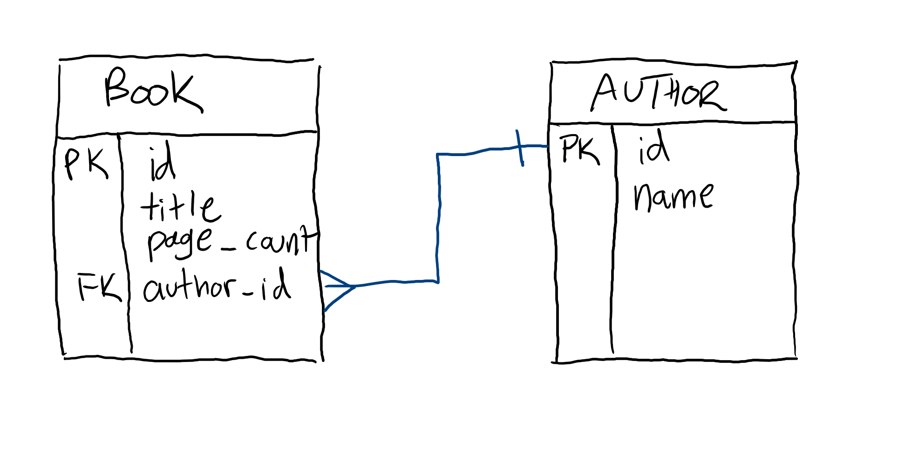

# Data Modeling: One-to-Many

The most common type of data relationship is One-to-Many:

It's not unusual to see an ERD comprised entirely of one-to-many relationships. How can you recognize this relationship?

## One-to-Many Relationships

The most critical question when determining a relationship between two entities is: "How many of one thing is another thing allowed to have?" The difficulty of the question is compounded by the fact that you need to think about the specific application that you're building. For example:

* One owner may have many pets, but each pet can only have one owner.
* One owner may have many pets, and each pet can only many owners.

Both of those situations are reasonable. In the first case, every pet has one canonical owner, which may be useful for having a single point of legal responsibility. The second case adds complexity, but may be useful for situations where it may useful to have multiple people to contact in case of emergency. Both situations are real; your particular application's needs determine which data model is correct.

## Databases

### Primary Keys

Ideally, every record in a database is uniquely identified by at least one value. It's most common for this to be an auto-incrementing integer that's set by the database.

| id | name |
| --- | --- |
| 1 | Duke Ellington |
| 2 | Kenny Burrell |
| 3 | Julian Adderly |

If you were to add another record to the database, it would automatically be given the id `4`. While columns like names may work as unique identifiers, there are two problems:

* They might not actually be unique. For example, there are a musician and an actor that both have the name "Hank Jones."
* They might change. "Julian Adderly" started going by "Cannonball Adderly" in high school. If his name were the unique identifier, it would need to be updated everywhere he was referenced. When a so-called surrogate key like an auto-incrementing ID is used, no change in the underlying data needs to change any of the references in the database.

In a schema diagram, the primary key is often marked with a PK in the first column.

### Foreign Keys

Databases enforce relationships with columns that are marked as "foreign keys." A foreign key in one table is a primary key in another table.

For example, a `blog_post` has an `author_id` of `3`. Every `author_id` needs to match an `id` in the `author` table. Since `author` does not currently have a record with an `id` of `25`, attempting to add a `blog_post` with an `author_id` of `25` will fail.

`author`

| id | name |
| --- | --- |
| 1 | Joe Satriani |
| 2 | Steve Vai |
| 3 | Eric Johnson |

`blog_post`

| id | title | content | author_id |
| --- | --- | --- | --- |
| 1 | Learning JavaScript | JavaScript is difficult to learn but it doe... | 2 |
| 2 | Learning CSS | CSS is one of the fundamental bui... | 2 |
| 3 | Learning HTML | HTML is used to structured data wh... | 2 |

This doesn't prevent your database from taking in any bad data, but it can serve as a reasonable check.

### One-to-Many Relationships in a Database

At a low-level, One-to-Many relationships in a database mean that:

* A primary key only shows up one time in a table
* A foreign key can show up multiple times in a table

That means that when relating two tables, the "one" side of the relationship should always point to a primary key, and the "many" side of a relationship should always point to a foreign key.

## Watch Out!

* Data modeling relationships are abstract, not concrete. For example, a particular parent may only have one child, and that child may only have one parent, but that's only a One-to-One relationship if you would never refer to one of them independently from the other. If the parent _could_ have more than one child but each child could only have one parent, that's still a one-to-many relationship. If a parent _could_ have many children and a child could have more than one parent, that's a many-to-many relationship. Possibilities matter more than what the data happens to be in any one case.
* The biggest mistake you're likely to make when identifying One-to-Many relationships is reading the diagram wrong:

If you read this as "one room can have many windows and many windows have one room", you'll technically be correct but it's not likely to help your thinking very much. Instead, always focus on single items: "One room can have many TVs, but each TV can only be in one room."
* One record can have multiple foreign keys because it can be related to multiple tables.

## Additional Resources

| Resource | Description |
| --- | --- |
| [One-to-Many (data model)](https://en.wikipedia.org/wiki/One-to-many_(data_model)) | Wikipedia's article on One-to-Many relationships. |
| [What is a One-to-Many Relationship in a Database?](https://vertabelo.com/blog/one-to-many-relationship/) | A blog post on One-to-Many relationships |
