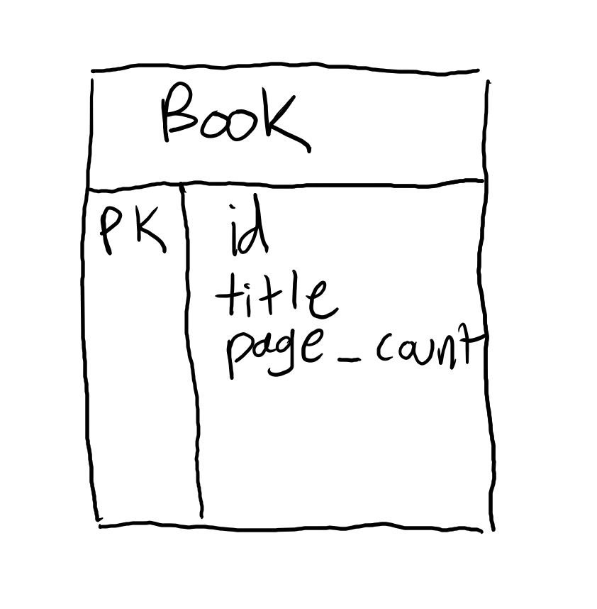
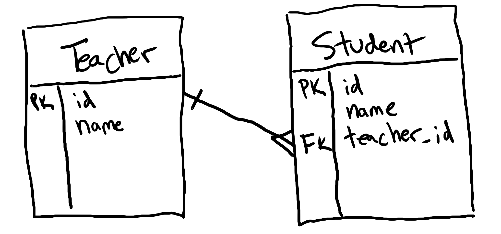

# Intro to Data Modeling

How would you model the data for a library of Harry Potter books? You could start with books:

But you might end up with Harry Potter books being under either "J.K. Rowling" and "Joanne K. Rowling." So, you make an author table, and reference it from the books table:

This works well, until you realize that "Harry Potter and the Cursed Child" had 3 authors. So you make a new table called "Authoring" that keeps track of each instance of an author being associated with a book:

Then you realize that the first Harry Potter book was alternately called "Harry Potter and the Sorcerer's Stone" and "Harry Potter and the Philosopher's Stone" based on which edition it was. So you can add a table for editions:

Then you realize that each book edition has had multiple printings, so you add a table for printings:

This is the process of relational data modeling.

## ERDs

Entity-Relationship Diagrams, or ERDs, describe things (entities) and their relationships with each other. The three basic categories of relationship are:

* 1-to-Many: This indicates that one entity can own more than one of another entity. For example, one building has many rooms, but each room can only be in one building.
* Many-to-Many: This indicates that entity can own more than one of another entity and vice-versa. For example, one building can have more than one administrator, and each administrator can manage more than one building.
* 1-to-1: This indicates that one entity is actually the same as another entity. For example, an employee may have a manager, who is also an employee.

There are other relationships in data modeling that are more nuanced, but they're subsets of these three types.

At their simplest, ERDs use a box for entities that describes the the attributes or properties of that entity.

The left column identifies keys. A PK in this column is called a primary key and describes an attribute that uniquely identifies each record. Most of the time, this will be an ID field that will be automatically populated by the database. An FK in this column means that an attribute is a foreign key, which is another entity's primary key. FKs are connected to PKs with lines and symbols called crow's feet. When reading an ERD, the end of the line with the crow's feet is pronounced "many", and the line with either a single crossing line or nothing is pronounced "one." This says "one teacher can have many students, but each student only can only have one teacher":

## Watch Out!

* Technically, an ERD is just entities and their relationships and doesn't include any attributes of the entities. ERDs don't even necessarily need to specifically be used for databases or even anything digital. A diagram that includes columns, data types, and keys is more properly called a schema diagram. In practice, "ERD" and "schema" are used interchangeably.
* A data model will never capture the complexity of the real world. Fortunately, they don't need to. A data model only needs to match the rules your application is expecting.
* ERDs capture abstract relationships. They aren't the data, they are the shape of the data.
* Entitites should be singular, meaning the correct name for a book model is "book", not "books".

## Additional Resources

| Resource | Description |
| --- | --- |
| [IBM: Data Modeling](https://www.ibm.com/cloud/learn/data-modeling) | IBM's overview of data modeling |
| [Wikipedia: Data Modeling](https://en.wikipedia.org/wiki/Data_modeling) | Wikipedia's article on data modeling |
| [Agile Data: Data Modeling 101](http://agiledata.org/essays/dataModeling101.html) | Overview of data modeling |
