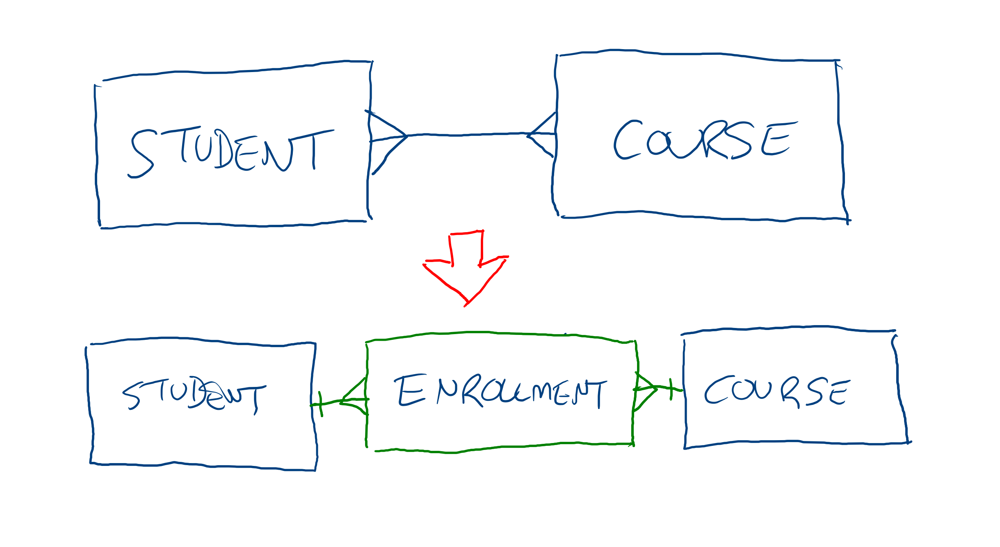
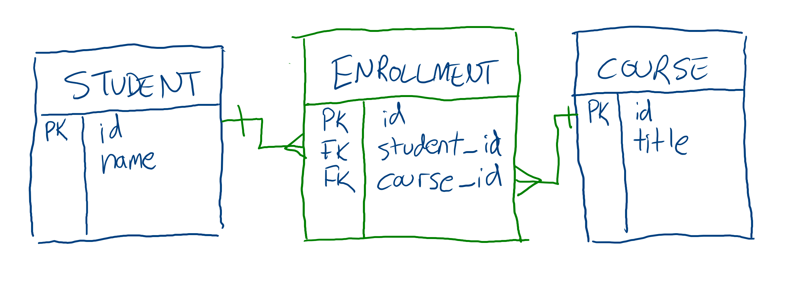

# Data Modeling: Many-to-Many

One-to-Many relationships are the most common type of relationships, but Many-to-Many relationships are the next most common. 

## Identifying Many-to-Many Relationships

A Many-to-Many relationship, also called an M:N relationship, happens when one entity has more than one of another entity and vice-versa. For example, a parent may have multiple children, and each child may have multiple parents.

## Many-to-Many Relationships in Databases

Relational databases generally don't have a way to represent Many-to-Many relationships directly. However, You can create a many-to-many relationship out of two One-to-Many relationships:

If one student can be enrolled in many courses, and each courses can contain multiple students, a third entity can represent each occurrence of a student being enrolled in a course:

This new entity is called a join table. Join tables are often abstract (_enrollment_ is a more abstract idea than either _student_ or _course_), but they're also useful in other ways. For example, an `enrollment` table may contain additional information such as the term of the enrollment or whether it's been paid for yet. The join table may even have its own relationships, such as a referencde to which registrar performed the enrollment.

When possible, try to come up with a descriptive name for join tables. Doing so may be helpful in deciding which data belongs on it and which other relationships it may have. This isn't always possible, in which case it's also acceptable to combine the two names of the tables its joining, such calling an enrollment `student_course`.

## Additional Resources

| Resource | Description |
| --- | --- |
| [Wikipedia: Many-to-Many (data model)](https://en.wikipedia.org/wiki/Many-to-many_(data_model)) | Wikipedia's article on Many-to-Many relationships |
| [What is a Many-to-Many Relationship in a Database?](https://vertabelo.com/blog/many-to-many-relationship/) | Blog post explaining Many-to-Many relationships |
