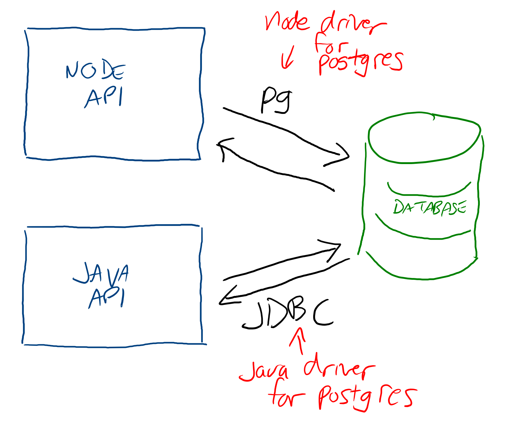

# Intro to Databases

Most applications have some state in the form of variables, but this kind of state is temporary. When a client-side application like a React app is run by the browser, it starts with whatever initial state is in the code. Likewise, the state in APIs is reset whenever the server is restarted. Where can you store data that needs to persist between restarts?

Persistent data is stored in databases, which are conceptually similar to spreadsheets. Both have rows and columns, and database tables are similar to sheets. However, databases are far more robust. They can enforce the shape and types of data that are stored, prevent data corruption, and offer powerful tools for quickly searching and manipulating stored data.

## Interacting With Databases From APIs

Databases typically run on their own servers, separate from file servers or API servers. API servers communicate with database servers using special software called database drivers. Databases are language-agnostic, meaning the same database can be used with Node.js, C#, Java, Python, or any other language that has a database driver compatibile with the database server.



API servers use these drivers to integrate databases into their code.

```js
const client = new Client({
  user: "database_user",
  host: "database.database-server.com",
  database: "database_name",
  password: "database_password",
  port: 5432,
})
client.query("SELECT * FROM dog")
  .then(result => console.log(result))
```

## Relations

The way data is stored in databases is different than how its stored in code. In most programming languages, data is represented as a series of nested structures:

```js
{
  name: "Cannonball Adderly",
  instrument: {
    type: "Alto Saxophone",
    manufacturer: "Selmer",
  },
  albums: [{
    name: "Something Else",
  },{
    name: "Mercy, Mercy",
  },{
    name: "Autumn Leaves",
  }]
}
```

This is similar to how most people think of data and works well in real-world problems. When that same data is represented flat in a database, problems start to emerge:

**musician**

| name |
| --- |
| Cannonball Adderly |

**instrument**

| type | manufacturer |
| --- | --- |
| alto saxophone | Selmer |

**album**

| name |
| --- |
| Something Else |
| Mercy, Mercy |
| Autumn Leaves |

This data is simple to store, but how do you store the relationships between them? How would you indicate that "Something Else" was played by Cannonball Adderly, or that Cannonball Adderly played a Selmer alto saxophone?

### Combined Columns

You could keep all of Cannonball Adderly's albums and instruments in the `musician` table as well:

**musician**

| name | albums | instrument_type | instrument_manufacturer |
| --- | --- | --- | --- |
| Cannonball Adderly | Something Else, Mercy\, Mercy, Autumn Leaves | alto saxophone | Selmer |

**instrument**

| type | manufacturer |
| --- | --- |
| alto saxophone | Selmer |

**album**

| name |
| --- |
| Something Else |
| Mercy, Mercy |
| Autumn Leaves |

The problem with this is that the data is now repeated in both places. It's possible for the data to get corrupted if data is removed, added, or changed from one source but not the other. Additionally, it's slower and more difficult to search for or perform operations on part of the data since multiple pieces of data are stored in one column.

### Repeating Rows

You could also reverse this and attach Cannonball Adderly's information to each record associated with him:

**musician**

| name |
| --- |
| Cannonball Adderly |

**instrument**

| type | manufacturer | musician |
| --- | --- | --- |
| alto saxophone | Selmer | Cannonball Adderly |

**album**

| name | musician |
| --- | --- |
| Something Else | Cannonball Adderly |
| Mercy, Mercy | Cannonball Adderly |
| Autumn Leaves | Cannonball Adderly |

Since the data isn't combined in any column, it's much easier to work with individual pieces of data. There's still a problem with repeating the data, however. If one of the albums' musicians changes to "Julian 'Cannonball' Adderly", there will be no way to determine that it's still referencing the same musician as the other albums.

### Relational Data

The solution is to represent each record with an ID and use those IDs as references throughout the database:

**musician**

| id | name |
| --- | -- |
| 1 | Cannonball Adderly |

**instrument**

| id | type | manufacturer | musician_id |
| --- | --- | --- | --- |
| 1 | alto saxophone | Selmer | 1 |

**album**

| id | name | musician_id |
| --- | --- | --- |
| 1 | Something Else | 1 |
| 2 | Mercy, Mercy | 1 |
| 3 | Autumn Leaves | 1 |

This way, the meaningful parts of each piece of data aren't repeated and only exist in one place, but can still be referenced by other tables. The unique IDs that identify each record within a table are called primary keys, and the references to those in other tables are called foreign keys. Relational databases enforce that each foreign key in a table has a matching primary key in the related table, which provides a layer of integrity to the data.

## DBMS Software

These are some popular tools used to manage databases:

| DBMS | Description |
| --- | --- |
| [PostgreSQL](https://www.postgresql.org/) | A full-featured open source database management system. |
| [SQLite](https://www.sqlite.org/index.html) | An extremely lightweight database system popular for local development and embedded systems. Stores the entire database in a single file. |
| [SQL Server](https://www.microsoft.com/en-us/sql-server) | A database management system owned by Microsoft |
| [Oracle](https://www.oracle.com/database/technologies/) | An enterpise database management system for building large distributed databases |
| [MySQL](https://www.mysql.com/) | A free database management system owned by Oracle that's popular in the PHP community |
| [MariaDB](https://mariadb.org/) | An open source version of MySQL |

## Watch Out!

The terms "table", "row", and "column are commonly used when talking about databases, but the academic terms are:

* **Relation**: Table
* **Tuple**: Row or record
* **Attribute**: Column

Each term and its synonyms can be used interchangeably.

Additionally, the term "database" technically refers to the actual files storing the data. The tools used to interact with databases, such as PostgreSQL or Oracle, are called database management systems or DBMSes. Tools that manage relational data are called relational database management systems, or RDBMSes. These contrast with database tools that manage non-relational data, such as MongoDB and Redis.

## Additional Resources

| Resource | Description |
| --- | --- |
| [Wikipedia: Database](https://en.wikipedia.org/wiki/Database) | Wikipedia's article on databases |
| [Wikipedia: Relational Database](https://en.wikipedia.org/wiki/Relational_database) | Wikipedia's article on relational databases |
| [IBM: Relational Databases Explained](https://www.ibm.com/cloud/learn/relational-databases) | IBM's article on relational databases |
