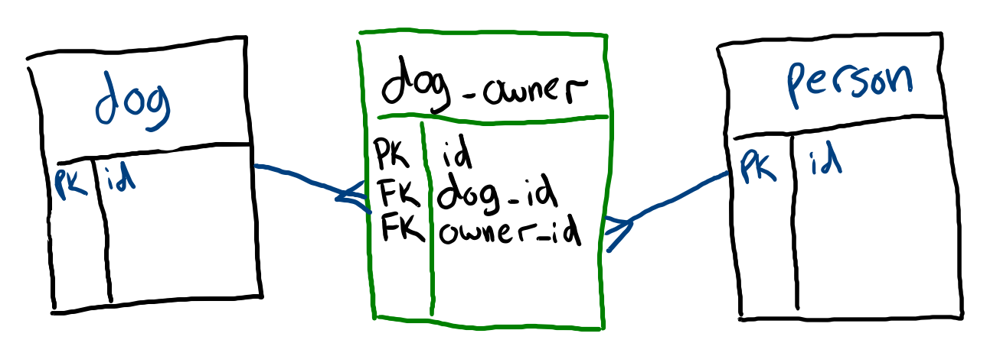

# Objection: Many-to-Many

Many-to-Many relationships have one of the largest Object-Relational impedance mismatches and as such they benefit the most from ORMs.

## Modeling Many-to-Many Relationships



Like One-to-Many relationships, Many-to-Many relations use the `relationMappings` static getter:

```js
class Dog extends Model {
  static tableName = "dog"

  static get relationMappings(){
    return {
      owners: {
        relation: Model.ManyToManyRelation,
        modelClass: require("./Person"),
        join: {
          from: "dog.id",
          through: {
            from: "dog_owner.dog_id",
            to: "dog_owner.owner_id",
          },
          to: "person.id"
        },
      },
    }
  }
}
```

```js
class Person extends Model {
  static tableName = "person"

  static get relationMappings(){
    return {
      dogs: {
        relation: Model.ManyToManyRelation,
        modelClass: require("./Dog"),
        join: {
          from: "person.id",
          through: {
            from: "dog_owner.owner_id",
            to: "dog_owner.dog_id",
          },
          to: "dog.id"
        },
      },
    }
  }
}
```

[Play with this code](https://codesandbox.io/s/relaxed-shannon-5y30d)

Most of this is the same as One-to-Many relationships. The key differences are using the `Model.ManytoManyRelation` class and adding the `through` object to the relation mapping.

```js
{
  join: {
    from: "dog.id",
    through: {
      from: "dog_owner.dog_id",
      to: "dog_owner.owner_id",
    },
    to: "person.id"
  },
}
```

The `through` object describes how each model table maps to the join table in the Many-to-Many relationships. It may be helpful to think of both `from`s matching and both `to`s matching.

## Reading Related Records

Reading related records in a Many-to-Many relationship works the same as One-to-Many:

```js
const ownersWithDogs = Person.query().withGraphFetched("dogs")
const dogsWithOwners = Dog.query().withGraphFetched("owners")
const personWithDogs = Person.query().findById(2).withGraphFetched("dogs")
Person.query().insertGraph([{
  name: "Kyle",
  dogs: [{
    name: "Bixby",
  },{
    name: "Mesa"
  }]
},{
  name: "Elyse",
  dogs: [{
    name: "Mesa", // Both Kyle and Elyse own Mesa
  },{
    name: "Harmony",
  }]
}])
```

## Watch Out!

The join table doesn't need its own Objection model unless you need to query that model directly.

## Additional Resources

| Resource | Description |
| --- | --- |
| [Objection: Relations](https://vincit.github.io/objection.js/guide/relations.html#examples) | Official Objection docs on relations |
