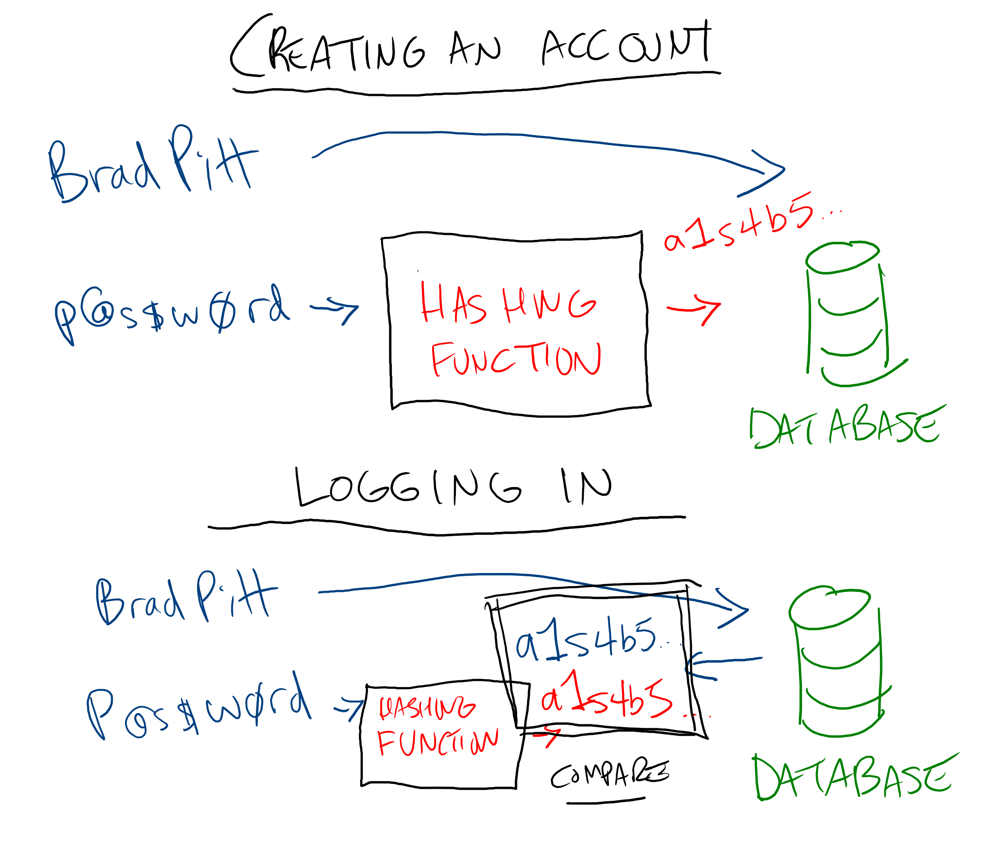

# Intro to Hashing

Imagine you're running a coat check at a celebrity gala. Celebrities want to store their valuables with you, but those valuables are a high-target theft item--even among people working the event. To complicate matters, the celebrities drop off their items but their assistants will likely be the ones picking them up. How can you tell who's authorized to pick up items for a particular celebrity?

A reasonable first step is having each celebrity set a password when they drop off their valuables. The problem is that everyone else working at the coat check can look up the passwords, which they would need to do to verify that someone gave the correct one. What keeps them from copying down a list of passwords and selling them to the highest bidder?

When Brad Pitt drops off his coat, he enters the password `soap`. If you substitute each letter in `soap` for the number of the alphabet it represents, you get `19 15 1 16`. If you sum those numbers, you get `51`. If you sum `5` and `1`, you get `6`. Using this formula--get the alphabetical position of each character and add them until you have one number left--you can reliably generate the number `6` from the password `soap`.

There are a lot of ways to get to `6`: `aaaaaa`, `cc`, and `thisisareallylongone` all turn into `6` using this formula. This means that even if you get access to the `6` stored in the computer, there's no way to reliably turn that back into `soap`. It's also statistically unlikely that someone will be able to just guess a password that turns into `6` with this formula on their first try, and close words like `soapy` or `soak` result in totally different numbers (`4` and `1`).

Taking an input and turning it into something that can be reliably checked but never reversed is called hashing.

## Hashing

If you wrote the letter-number-sum formula as code, it might look like this:

```js
function simpleHash(string){
  let hash = getLetterPosition(string)

  hash = string.split("").map(getLetterPosition).reduce(accumulate, 0)

  while (`${hash}`.length > 1){
    hash = `${hash}`.split("").reduce(accumulate, 0)
  }

  return hash
}
```

[Play with this code](https://codesandbox.io/s/hungry-margulis-27msn?file=/index.js)

This is called a hashing algorithm. It turns an input string into something statistically likely to be unique, but is otherwise irreversible. Hashing algorithms are an active area of math research and have many applications.

## Hashing Passwords

On the web, hashing is used to securely store passwords. When you create a new account on a website, it should hash the password and store it in a database. This way, if the database were ever compromised, the attacker would only have access to the hashes. However, if a user logs in with their password, that password can be rehashed and compared with the stored hash to verify the passwords match.



## Hashing Algorithms

A great hashing algorithm has these characteristics:

* Make full use of all the available output space
* It should be impossible to recreate the original input from the output
* It should be impossible to intentionally create a target output
* Small changes in the input should result in big changes in the output

Some popular hashing algorithms include:

* MD5: A hashing algorithm that was popular in the 90's until it was was declared broken because ways to intentionally create hashes were discovered.
* SHA1: A hashing algorithm that succeeded MD5, until similar vulnerabilities were discovered. It's no longer used for security, but has some other modern applications, such as identifying Git commits.
* bcrypt: One of the most popular hashing algorithms in web security. By design, it can be made more or less secure at the cost of processing power. This has helped it adapt over time; as cracking computer get faster, so do consumer computers.

Other modern hashing algorithms include SHA2, SHA3, BLAKE, and more. Each comes with different strengths and weaknesses, which make make them suitable for different applications.

## Additional Resources

| Resource | Description |
| --- | --- |
| [Wikipedia: Hash Functions](https://en.wikipedia.org/wiki/Hash_function) | Wikipedia's article on hash functions |
| [Wikipedia: Cryptographic Hash Functions](https://en.wikipedia.org/wiki/Cryptographic_hash_function) | Wikipedia's article on cryptographic hash functions |
| [Wikipedia: bcrypt](https://en.wikipedia.org/wiki/Bcrypt) | Wikipedia's article on bcrypt |
