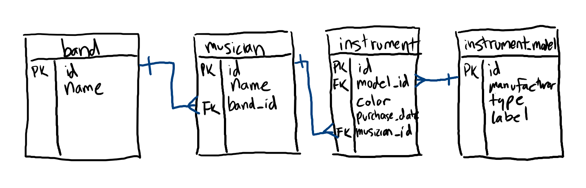

# SQL: Inner Joins

Writing queries for one table is straight-forward enough.

```sql
SELECT *
FROM student;

SELECT *
FROM instructor;
```

But how would you get all of one instructor's students?

## Joins

```sql
SELECT student.*
FROM student
INNER JOIN student.instructor_id = instructor.id
WHERE instructor.name = "Joe Satriani";
```

Joins add more tables to a query that you can display with `SELECT` and filter with `WHERE`. Columns in the `SELECT` and `WHERE` clauses are prefixed with the table. Joins happen between the primary key of one table (usually the ID) and the foreign key of another table. In other words, if Joe Satriani is an `instructor` with an ID of `9` (primary key), than his students probably have an `instructor_id` column with a `9` in it (foreign key). The join statement says that you want to match up the primary key to the foreign key.

## Writing a Join



In this model:

* Each band has multiple musicians, but each musician is in one band
* Each musician has multiple instruments, but each instrument is owned by one musician
* Each instrument model has multiple instruments, but each instrument is of one model

If you want to find out all of the instrument models used by the band 311, you need to traverse these 4 tables with joins.

```sql
SELECT DISTINCT band.name, instrument_model.label
FROM band
INNER JOIN musician.band_id = band.id
INNER JOIN instrument.musician_id = musician.id
INNER JOIN instrument.model_id = instrument_model.id
WHERE band.name = '311';
```

This will result in something like:

| band.name | instrument_model.label
| --- | --- |
| 311 | Pearl |
| 311 | Tama |
| 311 | GHS |
| 311 | PRS Guitars |
| 311 | Warwick |

Some guidelines:

* Don't worry too much about the logic of the joins. If you need data from two tables, just find a way to walk from one to the other. The logic of what to display is handled by `SELECT`, the logic of what to filter out is handled by the `WHERE` clause.
* The order of the columns in a join statement is not important.

## Watch Out!

* Much like an `AND` or `OR` depends on the presence of a `WHERE`, you need a `FROM` to `INNER JOIN` off of.

## Deep Dive

When you make an INNER JOIN, the database starts by making a cartesian product of the two tables. The clauses in your INNER JOIN eliminate everything except the records in the cartesian product where the primary key matches the foreign key.

## Additional Resources

| Resource | Description |
| --- | --- |
| [W3Schools: SQL Inner Join](https://www.w3schools.com/sql/sql_join_inner.asp) | W3Schools' tutorial on inner joins |
| [SQL Zoo: Joins](https://sqlzoo.net/wiki/The_JOIN_operation) | SQL Zoo's interactive tutorial on inner joins |
